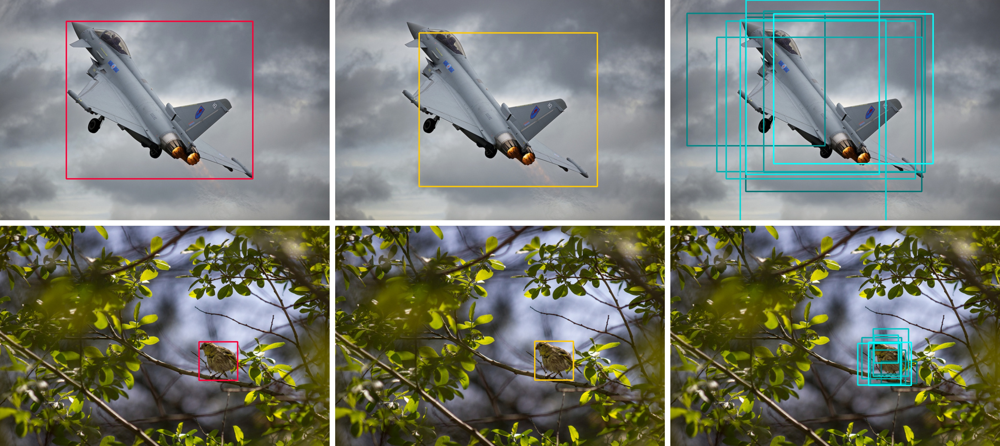

# ebms_regression



Official implementation (PyTorch) of the paper: \
**How to Train Your Energy-Based Model for Regression**, 2020 [[arXiv (TODO!)]]() [[project (TODO!)]](). \
_[Fredrik K. Gustafsson](http://www.fregu856.com/), [Martin Danelljan](https://martin-danelljan.github.io/), [Radu Timofte](http://people.ee.ethz.ch/~timofter/), [Thomas B. Schön](http://user.it.uu.se/~thosc112/)._ 

Energy-based models (EBMs) have become increasingly popular within computer vision in recent years. While they are commonly employed for generative image modeling, recent work has applied EBMs also for regression tasks, achieving state-of-the-art performance on object detection and visual tracking. Training EBMs is however known to be challenging. While a variety of different techniques have been explored for generative modeling, the application of EBMs to regression is not a well-studied problem. How EBMs should be trained for best possible regression performance is thus currently unclear. We therefore accept the task of providing the first detailed study of this problem. To that end, we propose a simple yet highly effective extension of noise contrastive estimation, and carefully compare its performance to six popular methods from literature on the tasks of 1D regression and object detection. The results of this comparison suggest that our training method should be considered the go-to approach. We also apply our method to the visual tracking task, setting a new state-of-the-art on five datasets. Notably, our tracker achieves 63.7% AUC on LaSOT and 78.7% Success on TrackingNet.

This repository contains code for the experiments on _**object detection**_ and _**1D regression**_. Code for the _**visual tracking**_ experiments is available at [pytracking](https://github.com/visionml/pytracking).

If you find this work useful, please consider citing:
```
TODO!
```


## Acknowledgements

- The object detection code is based on [maskrcnn-benchmark](https://github.com/facebookresearch/maskrcnn-benchmark) by [@facebookresearch](https://github.com/facebookresearch).
- The object detection code utilizes [PreciseRoIPooling](https://github.com/vacancy/PreciseRoIPooling) by [@vacancy](https://github.com/vacancy).


## Index

- [Usage](#usage)
- - [1D Regression](#1dregression)
- - [Object Detection](#detection)
- [Documentation](#documentation)
- - [1D Regression](#documentation1dregression)
- - [Object Detection](#documentationdetection)
- [Pretrained model](#pretrained-model)
***
***
***


***
***
***
## Usage

The code has been tested on Ubuntu 16.04. A docker image is provided (see below).

- [1D Regression](#1dregression)
- [Object Detection](#detection)


### 1dregression

- $ docker pull fregu856/ebms_regression:ufoym_deepo_pytorch-py36-cu90_ebms_regression
- Create _start_docker_image_ebms_regression.sh_ containing (My username on the server is _fregu482_, i.e., my home folder is _/home/fregu482_. You will have to modify this accordingly):
```
#!/bin/bash

# DEFAULT VALUES
GPUIDS="0"
NAME="ebms_regression_GPU"

NV_GPU="$GPUIDS" nvidia-docker run -it --rm --shm-size 12G \
        -p 7200:7200\
        --name "$NAME""0" \
        -v /home/fregu482:/root/ \
        fregu856/ebms_regression:ufoym_deepo_pytorch-py36-cu90_ebms_regression bash
```
- (Inside the image, _/root/_ will now be mapped to _/home/fregu482_, i.e., $ cd -- takes you to the regular home folder)
- (To create more containers, change the lines _GPUIDS="0"_, _--name "$NAME""0"_ and _-p 7200:7200_)
- General Docker usage:
- - To start the image:
- - - $ sh start_docker_image_ebms_regression.sh
- - To commit changes to the image:
- - - Open a new terminal window.
- - - $ docker commit ebms_regression_GPU0 fregu856/ebms_regression:ufoym_deepo_pytorch-py36-cu90_ebms_regression
- - To exit the image without killing running code:
- - - Ctrl + P + Q
- - To get back into a running image:
- - - $ docker attach ebms_regression_GPU0
*
*

- Example usage:
```
$ sh start_docker_image_ebms_regression.sh
$ cd --
$ python ebms_regression/1dregression/1/nce+_train.py 
```
***
***
***


### detection

- $ docker pull fregu856/ebms_regression:ufoym_deepo_pytorch-py36-cu90_ebms_regression
- Create _start_docker_image_ebms_regression.sh_ containing (My username on the server is _fregu482_, i.e., my home folder is _/home/fregu482_. You will have to modify this accordingly):
```
#!/bin/bash

# DEFAULT VALUES
GPUIDS="0"
NAME="ebms_regression_GPU"

NV_GPU="$GPUIDS" nvidia-docker run -it --rm --shm-size 12G \
        -p 7200:7200\
        --name "$NAME""0" \
        -v /home/fregu482:/root/ \
        fregu856/ebms_regression:ufoym_deepo_pytorch-py36-cu90_ebms_regression bash
```
- (Inside the image, _/root/_ will now be mapped to _/home/fregu482_, i.e., $ cd -- takes you to the regular home folder)
- (To create more containers, change the lines _GPUIDS="0"_, _--name "$NAME""0"_ and _-p 7200:7200_)
- General Docker usage:
- - To start the image:
- - - $ sh start_docker_image_ebms_regression.sh
- - To commit changes to the image:
- - - Open a new terminal window.
- - - $ docker commit ebms_regression_GPU0 fregu856/ebms_regression:ufoym_deepo_pytorch-py36-cu90_ebms_regression
- - To exit the image without killing running code:
- - - Ctrl + P + Q
- - To get back into a running image:
- - - $ docker attach ebms_regression_GPU0
*
*
- $ docker attach ebms_regression_GPU0
- $ cd ebms_regression
- $ git clone https://github.com/cocodataset/cocoapi.git
- $ cd cocoapi/PythonAPI
- $ python setup.py build_ext install
- $ cd ebms_regression
- $ git clone https://github.com/NVIDIA/apex.git
- $ cd apex
- $ python setup.py install --cuda_ext --cpp_ext
- $ cd ebms_regression/detection
- $ python setup.py build develop
- Ctrl + P + Q
- $ docker commit ebms_regression_GPU0 fregu856/ebms_regression:ufoym_deepo_pytorch-py36-cu90_ebms_regression
*
*
- Download the code from https://github.com/vacancy/PreciseRoIPooling and place in ebms_regression/detection/external/PreciseROIPooling.
*
*
- Download the COCO dataset:
- - $ docker attach ebms_regression_GPU0
- - $ cd ebms_regression/detection/datasets/coco
- - Download annotations_trainval2017.zip ($ wget http://images.cocodataset.org/annotations/annotations_trainval2017.zip) and unzip ($ unzip annotations_trainval2017.zip).
- - Download train2017.zip ($ wget http://images.cocodataset.org/zips/train2017.zip) and unzip ($ unzip train2017.zip).
- - Download val2017.zip ($ wget http://images.cocodataset.org/zips/val2017.zip) and unzip ($ unzip val2017.zip).
- - Download test2017.zip ($ wget http://images.cocodataset.org/zips/test2017.zip) and unzip ($ unzip test2017.zip).
- - (detection/datasets/coco should now contain the folders annotations, train2017, val2017 and test2017)
*
*
- Download a pretrained Faster-RCNN detector (e2e_faster_R-50-FPN_1x.pkl) from https://drive.google.com/open?id=1Ows6VAPH5i5Y-gL9uHDa1SASZ0WQmxOj and place in detection/pretrained_models.
*
*

- Example usage:
```
$ sh start_docker_image_ebms_regression.sh
$ cd --
$ cd ebms_regression/detection
$ python tools/train_net.py --config-file "configs/nce+_train.yaml"
```
***
***
***


***
***
***
## Documentation

- [1D Regression](#documentation1dregression)
- [Object Detection](#documentationdetection)


### Documentation/1dregression

- Example usage:
```
$ sh start_docker_image_ebms_regression.sh
$ cd --
$ python ebms_regression/1dregression/1/nce+_train.py 
```

1dregression/1 contains all code for the first dataset, 1dregression/2 all code for the second dataset.

- **1dregression/1/model.py**: Definition of the feed-forward DNN f_\theta(x, y). Identical to **1dregression/2/model.py**.
- **1dregression/{1, 2}/datasets.py**: Definition of the {first, second} dataset.
- **1dregression/{1, 2}/{{mlis, mlmcmcL16, kldis, nce, sm, dsm, nce+}}_train.py**: Train 20 models on the {first, second} dataset using {{ML-IS, ML-MCMC-16, KLD-IS, NCE, SM, DSM, NCE+}}.
- **1dregression/{1, 2}/{{mlis, mlmcmcL16, kldis, nce, sm, dsm, nce}}_eval.py**: Evaluate the KL divergence to the true p(y | x) for all 20 trained models, compute the mean for the 5 best models. 
- **1dregression/{1, 2}/{{mlis, mlmcmcL16, kldis, nce, sm, dsm, nce}}_viz.py**: Visualize (p(y | x; \theta)) for one of the 20 trained models ([example plot for NCE+](https://github.com/fregu856/ebms_regression/blob/master/1dregression/training_logs/model_1-nce%2B/pred_dens_epoch_76.png)). 
***
***
***


### Documentation/detection

- Example usage:
```
TODO!
```

- TODO!
***
***
***


***
***
***
## Pretrained model

- Object detection model trained with NCE+: https://drive.google.com/open?id=1F7QoRJpbWQOWprD1Zefp050Ua8MYVFLW.
*
- Evaluate pretrained model on 2017 val:
- - Download the file nce+_model_0060000.pth from above and place in detection/pretrained_models.
- - $ sh start_docker_image_ebms_regression.sh
- - $ cd --
- - $ cd ebms_regression/detection
- - $ python tools/test_net.py --config-file "configs/nce+_eval_pretrained_val.yaml"
- - Expected output:
```
AP, AP50, AP75, APs, APm, APl
0.3936, 0.5799, 0.4263, 0.2220, 0.4257, 0.5188
```
*
- Evaluate pretrained model on 2017 test-dev:
- - Download the file nce+_model_0060000.pth from above and place in detection/pretrained_models.
- - $ sh start_docker_image_ebms_regression.sh
- - $ cd --
- - $ cd ebms_regression/detection
- - $ python tools/test_net.py --config-file "configs/nce+_eval_pretrained_test-dev.yaml"
- - TODO!
- - Expected output:
```
TODO! TODO!
```

